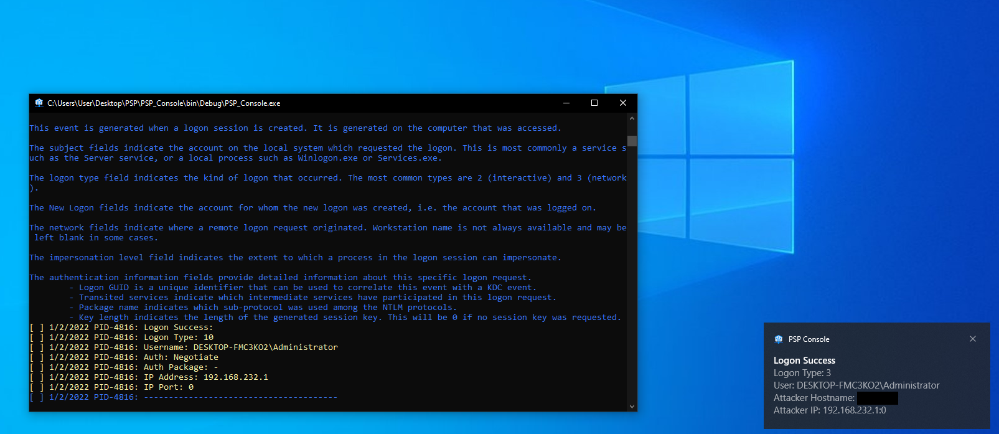
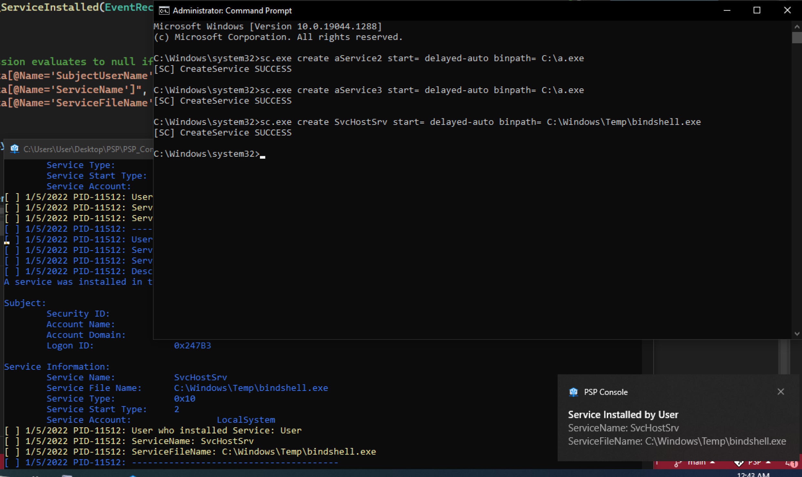
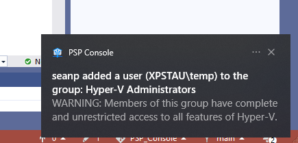

# Personal Security Product

Sean Pierce

As normal computer user, I've always been a little miffed that I don't have a basic awareness of who is remotely accessing/scanning/attacking my machine. So I created this program to simply notify me of the most obvious events I would want to know about.

## How to Compile:
- Right click on the project in the "Solution Explorer" and choose, "Manage NuGet Packages" and install, "Microsoft.Toolkit.Uwp.Notifications"
- Right click and "Run as Admin"

## Features:
- When something attempts to remotely accessing/scanning/attacking my machine a toast notification will notify the user
- Full details are writen to %Programdata%\PSP_Logs
- Toast on-click event opens the xml log 
- Supported Events:
   - 4624 - Logon Success 
   - 4625 - Logon Failed 
   - 4697 - Service Installed
   - 1102 - Security Log Cleared
   - 4798 - Local Group Enum
   - 4726 - User Deleted
   - 4720 - User Created
   - 4722 - User Enabled
   - 4732 - User Added To Group
   - 4622 - Lsass Loaded Package
   - 4614 - Notifcation Package Loaded
   - 4611 - Lsass Logon
   - 4610 - Lsass Loaded Auth Package
   - 4648 - User Logon With Creds
   - 4724 - Password Reset

## How to Install
- Double click and it should pop a UAC prompt
- Enable "Security System Extension" to support these events: https://www.windows-security.org/b355febe2c7a2ae1eaba46c4470d6d4a/security-system-extension . See if your machine is already collecting them with the command: `AuditPol /get /category:* | grep "Security System Extension"` By default it will say, "No Auditing". We (probably) need it to say, "Success"
 - Inspired based on: https://www.stigviewer.com/stig/windows_7/2017-12-01/finding/V-26556 Fix Text (F-29805r1_fix)
 - GUI - secpol.msc  https://docs.microsoft.com/en-us/windows/security/threat-protection/security-policy-settings/how-to-configure-security-policy-settings enable "Audit Security System Extension" . C# - https://docs.microsoft.com/en-us/dotnet/api/system.security.accesscontrol.filesystemauditrule?view=net-6.0
 - GUI - gpedit.msc: Computer Configuration\Windows Settings\Advanced Audit Policy Configuration\System -> "Audit Security System Extension"

## Future Feature Ideas:
- Automatically enable additional logging such as "(Audit) System Security Extention" to start producing events such as 4697 (Service Installed)
- Add default actions to the Toast notifications ('Block IP', 'Start watching for new processes as that user/Service', 'scan for yara sigs', 'Check VT for Exe', 'Launch Autoruns', 'Kill Service', 'Log off user and reset password', etc.)
- Add a better sound for the Toast Notification
- Add icons for the Toast Notification
- Add icons for the Toast Notification buttons - https://docs.microsoft.com/en-us/windows/apps/design/shell/tiles-and-notifications/adaptive-interactive-toasts?tabs=builder-syntax
- Reimplement as a service
- Reimplement as a Red Team situational awareness tool
- subscribe to events on a remote computer: https://docs.microsoft.com/en-us/previous-versions/bb671202(v=vs.90)?redirectedfrom=MSDN
- Send toast notications to a remote computer
- Perhaps look at implementing good basic execution rules? (Example: High Entropy file names)
- Perhaps look at what a local sigma instance might look like?

## Credits
Icon from: https://icon-icons.com/download/127074/ICO/512/